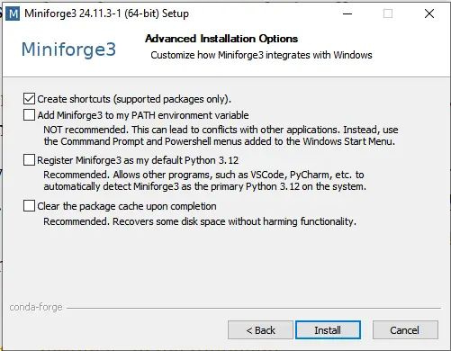
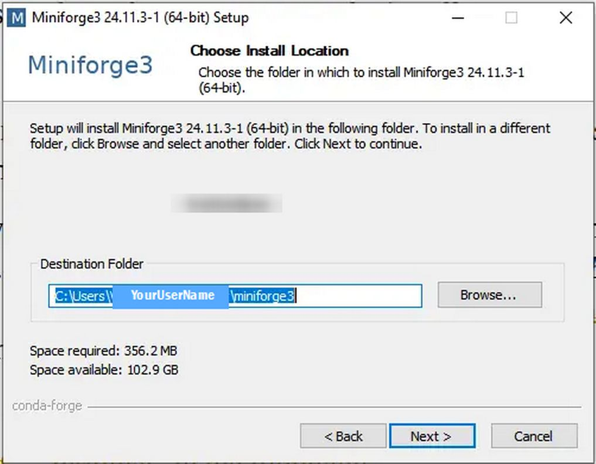
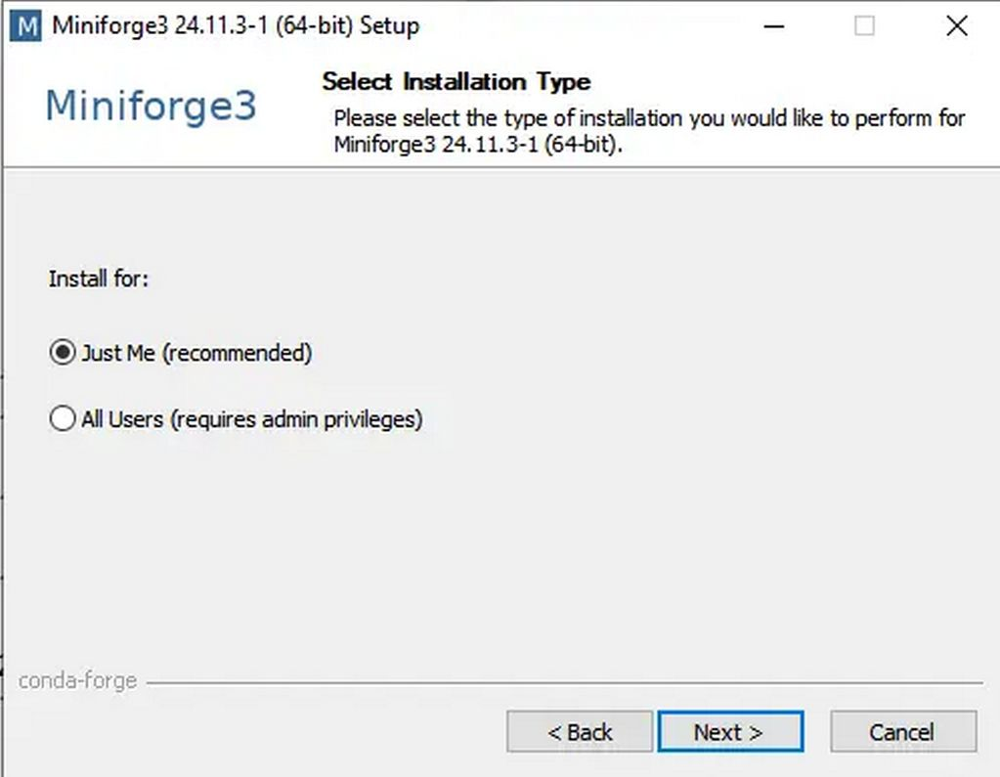
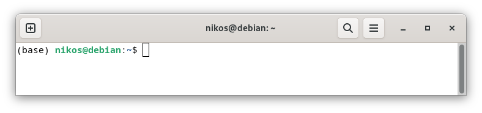
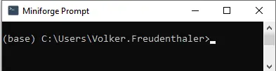
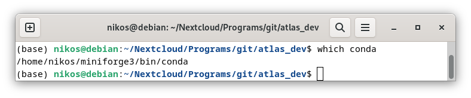
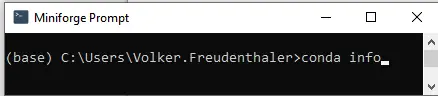
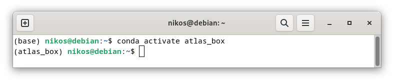
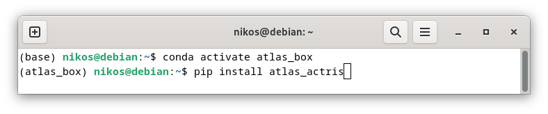
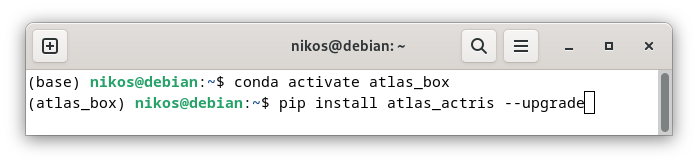

# ATLAS Installation

This part covers in detail the installation process of ATLAS for users not already familiar with creating python environments

## Introduction
The **recommended way to install ATLAS** is by creating a conda environment: 

[Installing ATLAS with conda](#installing-atlas-with-conda) 

**Expert python users** that don’t want to install conda and know what they are doing can alternatively try one of these approaches:

[Installing ATLAS without conda](#installing-atlas-without-conda) 
	
##  Installing ATLAS without conda
ATLAS can be installed by using the following command in a python 3.9 environment:

```bash
pip install atlas_actris 
```

Currently using python 3.9 is mandatory because other versions might lead to dependency issues.

Linux users that happen to have python 3.9 installed in their system and have admin rights can install pip on the system and create a virtual environment with venv. Please note that venv uses the system’s python, so this approach will probably fail to work if the system is using something other than python 3.9. 

In the future ATLAS support will be added for a range of python versions. 

Windows users can install python 3.9 e.g. from here:
https://www.python.org/downloads/release/python-390/
and then use venv to create a virtual environment. 

Please make sure that pip is installed and available in the environment. 
After the environment is installed, activate it and install ATLAS with pip by typing:

```bash
pip install atlas_actris 
```

The ATLAS source code will be installed in a folder named atlas_dev within your environment folder. The quickest and easiest way to find it is to just search for it. However, users are strongly discouraged of making changes directly on the source code installed by pip. 

**Important note for ATLAS developers**: Upgrading ATLAS through pip will delete any local changes in the scripts of the ATLAS source folder, which is installed within the conda environment. Please avoid making any changes to that folder. Users that are interested in developing their own scripts or want to contribute to the development of ATLAS are strongly encouraged to still install ATLAS through pip (so that the dependencies are correctly installed) but download and work on the source code from the ATLAS Github repository: https://github.com/nikolaos-siomos/ATLAS 

If changes must be made then it is recommended to download and work on the ATLAS source from Github (https://github.com/nikolaos-siomos/ATLAS) within the created environment, so that the dependencies are met. The source code installed by pip should be used only for executing the main scripts using configuration and setting ascii files stored out of the python environment.

## Installing ATLAS with conda
The recommended way to install ATLAS is through conda, because it is possible to create environments with a specific python version installed. 
Users with any form of conda already installed (e.g. through anaconda, miniconda, or miniforge) can skip steps 1 and 2.
In this tutorial we will use miniforge (see: What is the difference between miniconda and miniforge?),
but the process of installing conda through anaconda or miniconda is very similar. Please follow the steps below.

### Step 1: Download the miniforge installer
The installer for different operating systems is provided in the following link:
https://conda-forge.org/download/

### Step 2: Install miniforge
Please follow the instructions on the webpage to execute the installer.

**Linux:** 

At the last stage of installation, users will be asked if they want to have the base environment activated by default on their shell (terminal). 

Selecting yes in most cases will make life easier. Linux users should keep in mind that if you already have enabled this option (e.g. from a previous anaconda installation) the new base environment from miniforge will supersede the old base environment that was used until now in the terminal by default. If this is not what you want then please select no at this stage.

**Windows 10:**
 
 
 
 

### Step 3: Activate the base environment

**Linux:**

People that selected yes at the end of the previous step should already have an activated base environment next time they open a new terminal.

People that selected no at the end of the previous step can activate the base environment in the terminal by typing: source <path to the activate script inside the miniforge folder>

For example:

```bash
source /home/nikos/miniforge3/bin/activate
```

**Windows 10:**

In the Start Menu there is a new item "Miniforge Prompt". If you click on it, you open a Windows command prompt (terminal) with the (base) environment already activated.

No matter which approach was selected, the users should see “(base)” written on their terminal like in the example below:

**Linux:**

 

**Windows:** 

 

To verify that you are using the right base environment please type the following command while being inside the base environment:

**Linux:**

 


**Windows:**




It should return a path within the miniforge folder (or your expected conda installation folder). 

For example:
|   |   |
|---|---|
|Linux| /home/nikos/miniforge3/bin/conda |
|Windows| active env location: C:\Users\YourUserName\miniforge3|
|   |   |

### Step 4: Create a new environment

First make sure that you are working in the base environment.
If you are unsure which is your current active environment, look at your terminal. The environement should be mentioned in the beginning of the cursor line (see images of [Step 3](#step-3-activate-the-base-environment)).

The line should start with:
|   |   |
|---|---|
|Linux| (base) user@linux_distro:|
|Windows| (base) C:\Users\YourUserName>|
|   |   |  

In the base environment type:
```
conda create -n atlas_box python=3.9 pip
```

This will create a new environment called “atlas_box” with python 3.9 and pip installed. The users can also select a different name for their environment. 

Please note that if the name “atlas_box” is already assigned to an existing environment, a new name must be selected. This is relevant to users that are using an existing conda installation with an atlas_box environment.

### Step 5: Activate the new environment

The environment can be activated by typing:
```
conda activate atlas_box
```
For example:



### Step 6: Install or update ATLAS
Install ATLAS from the pip repository (https://pypi.org/project/atlas-actris/) by typing the following command in the activated atlas_box environment:
```
pip install atlas_actris
```
For example:


To install a specific version of ATLAS (not recommended) you can type instead:
```
pip install atlas_actris==0.4.9
```
This will install version 0.4.9 (if it still available in PyPI)
The ATLAS source code will be installed in a folder named atlas_dev within your environment folder. The quickest and easiest way to find it is to just search for it. However, users are strongly discouraged of making changes directly on the source code installed by pip. 

If changes must be made then it is recommended to download and work on the ATLAS source from Github (https://github.com/nikolaos-siomos/ATLAS) within the created environment, so that the dependencies are met. 

The source code installed by pip should be used only for executing the main scripts using configuration and setting ascii files stored out of the python environment.

### Step 7 (optional): Update ATLAS
If ATLAS is already installed and a new update came out, it is possible to update through pip by typing:
```
pip install atlas_actris --upgrade
```
For example:



Please note that it is not possible to install/update ATLAS using conda. Conda is used only for the creating of the environment and the installation of pip and python3.9.

### Step 7: Install an IDE (optional)

It is convenient to install an integrated development environment (IDE) to better edit and view scripts (optional). To avoid dependency issues it is recomended to install itin the new environment (e.g. atlas_box) with pip.
```
pip install spyder
```

Windows users should be carefull and make sure they are using the correct Spyder IDE since Spyder is usually installed by default in the base environment and it visible in the Windows startup menu.

The safest way to make usre that the correct Spyder is used is to run it from the correct environment:

#### 1) Activate environment
```
conda activate atlas_box
```
#### 2) Run spyder
```
spyder
```
